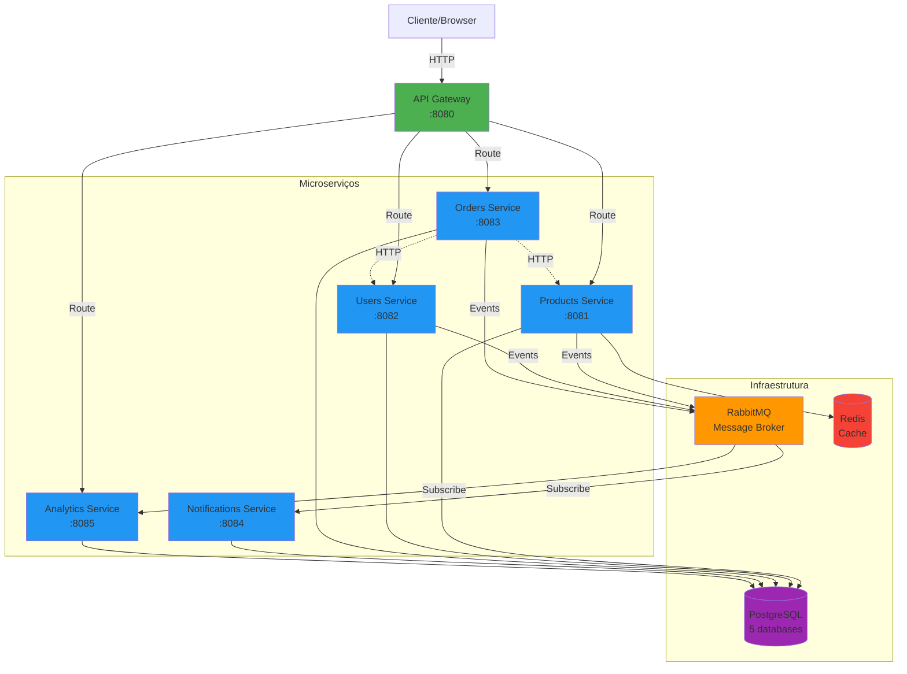
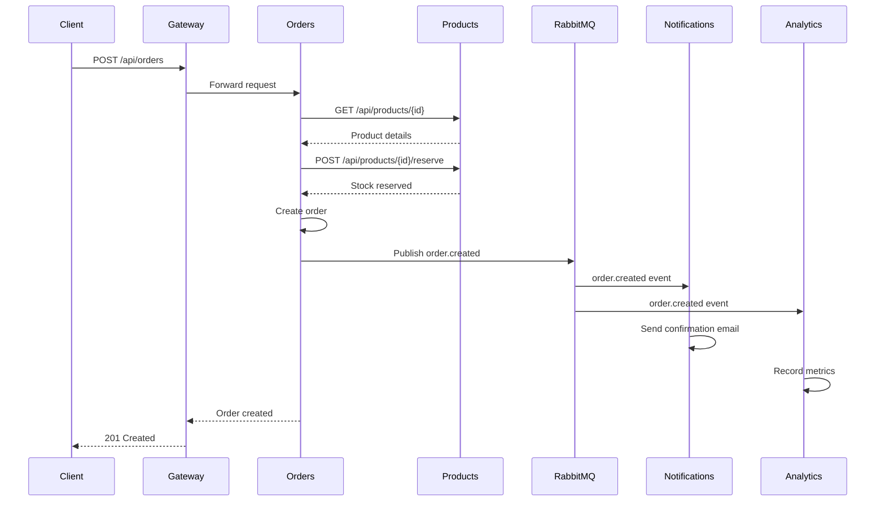
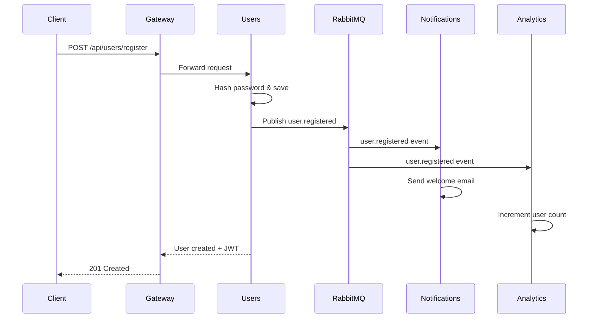

# Arquitetura de Microsserviços E-commerce

## Visão Geral

Este documento detalha a arquitetura do sistema de e-commerce baseado em microsserviços.

## Diagrama de Arquitetura



## Fluxo de Comunicação

### 1. Criação de Pedido (Síncrono + Assíncrono)



### 2. Registro de Usuário (Event-Driven)



## Padrões de Arquitetura Implementados

### 1. API Gateway Pattern
- **Propósito**: Ponto de entrada único para clientes
- **Benefícios**:
  - Roteamento centralizado
  - Circuit breaker para resiliência
  - Possibilidade de rate limiting
  - CORS handling

### 2. Database per Service
- **Propósito**: Isolamento de dados
- **Implementação**: 5 bancos PostgreSQL separados
- **Benefícios**:
  - Escalabilidade independente
  - Mudanças de schema isoladas
  - Tecnologias de BD diferentes se necessário

### 3. Event-Driven Architecture
- **Propósito**: Comunicação assíncrona desacoplada
- **Implementação**: RabbitMQ com Topic Exchange
- **Eventos**:
  - `product.*` - Eventos de produto
  - `user.*` - Eventos de usuário
  - `order.*` - Eventos de pedido

### 4. Circuit Breaker
- **Propósito**: Prevenir falhas em cascata
- **Implementação**: Resilience4j no API Gateway
- **Configuração**:
  - Sliding window: 10 requisições
  - Failure threshold: 50%
  - Wait duration: 10 segundos

### 5. Caching
- **Propósito**: Reduzir carga no banco de dados
- **Implementação**: Redis no Products Service
- **TTL**: 10 minutos
- **Estratégia**: Cache-aside com invalidação em updates

## Tecnologias e Justificativas

| Tecnologia | Uso | Justificativa |
|------------|-----|---------------|
| Kotlin | Linguagem | Concisão, null-safety, interop Java |
| Spring Boot 3.2 | Framework | Ecossistema maduro, produtividade |
| PostgreSQL | Database | ACID, confiabilidade, features avançadas |
| RabbitMQ | Message Broker | Confiável, suporte a patterns complexos |
| Redis | Cache | Performance, estruturas de dados ricas |
| Docker | Containerização | Portabilidade, consistência ambiental |
| Flyway | Migrations | Versionamento de schema, rollback |

## Decisões de Design

### Por que RabbitMQ ao invés de Kafka?
- ✅ Routing flexível com exchanges e bindings
- ✅ Melhor para comunicação request-reply
- ✅ Menor complexidade operacional
- ✅ Suficiente para volume de mensagens do projeto

### Por que PostgreSQL para todos os serviços?
- ✅ Familiaridade e facilidade de setup
- ✅ Adequado para os tipos de dados (relacional)
- ✅ Em produção, poderíamos usar diferentes DBs por serviço

### Por que RestTemplate ao invés de Feign?
- ✅ Simplicidade para comunicação síncrona limitada
- ✅ Menos abstrações para entender o código
- ✅ Em produção, usaríamos WebClient (reactive)

## Escalabilidade

### Horizontal Scaling
Todos os serviços são stateless (exceto databases) e podem escalar horizontalmente:

```bash
docker-compose up --scale products-service=3 --scale orders-service=2
```

### Pontos de Atenção
- **Database**: PostgreSQL precisa de read replicas para escalar reads
- **Redis**: Cluster mode para alta disponibilidade
- **RabbitMQ**: Clustering para throughput maior

## Segurança

### Implementado
- ✅ Password hashing com BCrypt
- ✅ JWT tokens para autenticação
- ✅ Validação de input com Bean Validation
- ✅ SQL injection protection (JPA)

### TODO para Produção
- ❌ HTTPS/TLS em todas as comunicações
- ❌ JWT validation no API Gateway
- ❌ Rate limiting
- ❌ RBAC (Role-Based Access Control)
- ❌ Secrets management (Vault)

## Resiliência

### Circuit Breaker
```yaml
Comportamento:
- Closed: Requisições passam normalmente
- Open: Requisições falham imediatamente (após threshold)
- Half-Open: Tenta algumas requisições para testar recuperação
```

### Retry Logic
- Comunicação com Products Service tem retry implícito
- RabbitMQ faz redelivery automático em falhas

### Health Checks
Todos os serviços expõem `/actuator/health` com verificação de:
- Database connectivity
- RabbitMQ connectivity
- Redis connectivity (Products Service)

## Monitoramento

### Metrics Disponíveis
```bash
# Métricas JVM
GET /actuator/metrics/jvm.memory.used
GET /actuator/metrics/jvm.threads.live

# Métricas HTTP
GET /actuator/metrics/http.server.requests

# Métricas de negócio (custom)
GET /actuator/metrics/orders.created
GET /actuator/metrics/products.sold
```

### Logs
- Structured logging em JSON (facilita parsing)
- Correlation IDs para rastreamento (TODO)
- Níveis: DEBUG para dev, INFO para prod

## Limitações Conhecidas

1. **Transações Distribuídas**: Sem SAGA pattern, pode haver inconsistências
2. **Service Discovery**: URLs hardcoded, não dinâmico
3. **Observabilidade**: Sem distributed tracing
4. **Testes**: Coverage parcial, faltam testes E2E
5. **CI/CD**: Básico, sem deploy automático

## Evolução Futura

### Curto Prazo
1. SAGA pattern para transações distribuídas
2. API Gateway authentication
3. Complete test coverage

### Médio Prazo
1. Kubernetes deployment
2. Distributed tracing (Zipkin/Jaeger)
3. Service mesh (Istio)

### Longo Prazo
1. CQRS + Event Sourcing
2. Multi-region deployment
3. ML-based recommendations
